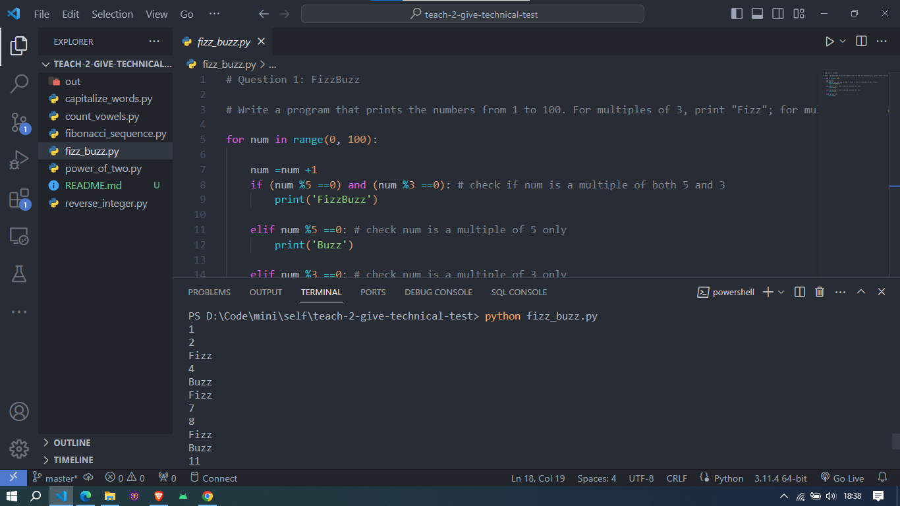
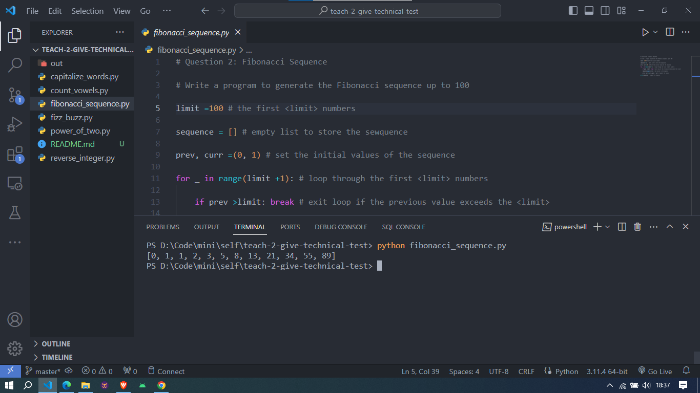
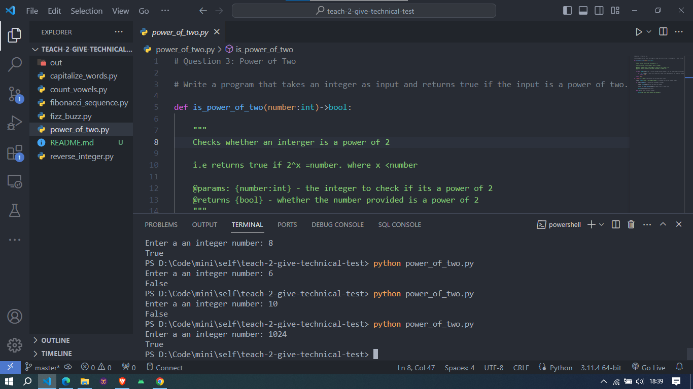
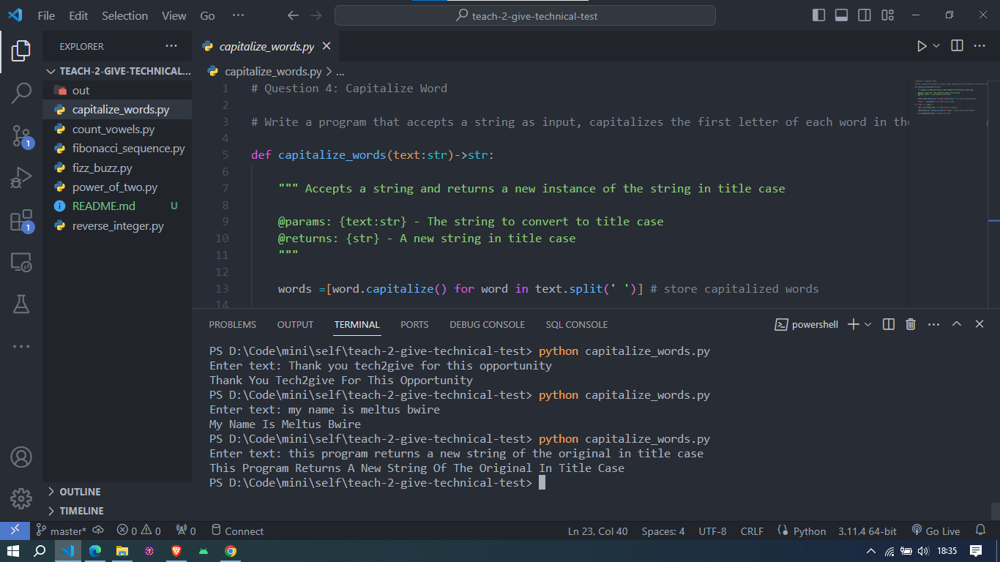
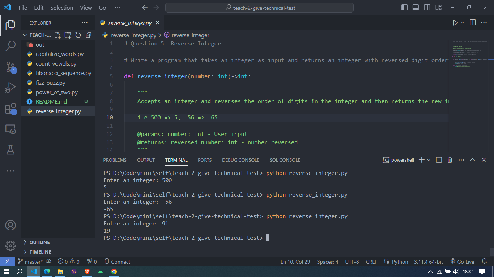
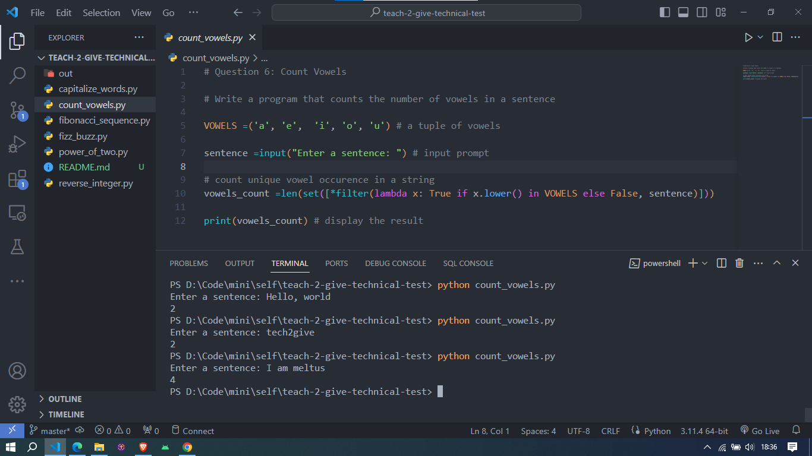

### TEACH2GIVE TECHNICAL TEST

Hello, and welcome. Here is a guide to my implementation of the Teach2Give Technical Test Challenge. 

Outlined is:
* Setup
* Expected output

#### Setup

Language: `python-3.11` or `python-3.x`
Platform: `Windows 10`, however `All major platforms running python-3.x are supported`
Editor: `VS Code`, however any text editor can be used to edit the code

Clone this repository to your local environment in order to run it.

Open your terminal and run the command `python <filename.py>` on `windows` or `python3 <filename.py>` on `linux` and `mac`

Replace `<filename.py>` with the actual file in the project directory to execute.

#### Output

##### Question 1: Fizz Buzz

##### Question 2: Fibonacci Sequence

##### Question 3: Power of Two

##### Question 4: FizzBuzz

##### Question 5: Reverse Integer

##### Question 6: Count Vowels

